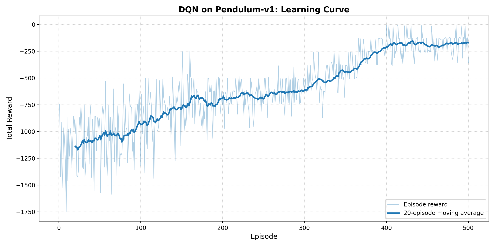

# Warm-Up Exercise: DQN on the Inverted Pendulum

Before applying Deep Reinforcement Learning to trading, we solved a smaller,
well-understood control problem first: balancing the **Inverted Pendulum**
(`Pendulum-v1`). This gave us a clean testbed to implement a Deep Q-Network (DQN)
from scratch and confirm we understood every piece before moving to the noisier
world of stock prices.

The code lives in [`../pendulum_dqn/`](../pendulum_dqn/).

---

## 1. The Problem

A pole is attached to a pivot and starts in a random position, usually hanging down.
The agent applies a **torque** each step and tries to swing the pole up and keep it
balanced pointing straight up.

* **State (3 numbers):** the cosine of the angle, the sine of the angle, and the
  angular velocity. Using cosine and sine (instead of the raw angle) avoids the jump
  that would happen when the angle wraps around from $2\pi$ back to $0$.
* **Action:** a single continuous torque, any real number in $[-2.0, 2.0]$.
* **Reward:** always negative. The penalty is smallest (closest to zero) when the
  pole is upright and still, and largest when it is pointing down and spinning. So a
  better agent earns a reward closer to zero.

---

## 2. The Catch: Making a Continuous Problem Discrete

DQN learns one Q-value per action and then picks the largest, $\max_a Q(s,a)$. This
only works when there is a **finite list** of actions to compare. Pendulum's torque
is continuous, so there are infinitely many actions and no way to take that maximum.

Our fix is **action-space discretization**: we replace the continuous range with a
fixed menu of 11 evenly spaced torque values,
$$\{-2.0,\ -1.6,\ -1.2,\ \dots,\ 1.6,\ 2.0\}.$$
The agent now chooses an integer index $0..10$, and a small wrapper
(`discretize_wrapper.py`) translates that index back into the matching torque before
the physics step runs. 11 values is a deliberate trade-off: enough control to balance
the pole, few enough that learning stays fast.

---

## 3. The Building Blocks

Our implementation mirrors the DQN design described in Part 2 of the report.

### Replay Buffer (`replay_buffer.py`)
A fixed-size memory (capacity 100,000) that stores every transition
$(s, a, r, s', \text{done})$. During training we draw a **random mini-batch** of 64
from it. Random sampling breaks the strong correlation between consecutive steps,
which is what keeps the network from destabilising, and lets each experience be
reused many times.

### Q-Network (`q_network.py`)
A small multi-layer perceptron that reads the 3-number state and outputs 11
Q-values in one pass:
$$\text{state (3)} \to 128 \to 128 \to \text{Q-values (11)},$$
with ReLU activations on the hidden layers and no activation on the output (Q-values
are unbounded).

### DQN Agent (`agent.py`)
Holds two copies of the network and the learning logic:

* **Main network** — updated every step.
* **Target network** — a frozen copy used to compute the learning target, synced with
  the main network every **100** updates. This stops the target from moving on every
  step (the "chasing its own tail" problem) and keeps training stable.
* **Epsilon-greedy actions** — with probability $\varepsilon$ pick a random action,
  otherwise pick $\arg\max_a Q(s,a)$. $\varepsilon$ starts at 1.0 (all exploration)
  and decays toward 0.01 (mostly exploitation).

The learning step minimises the mean-squared error between the current estimate and
the Bellman target:
$$L = \big(\,r + \gamma \max_{a'} Q_{\text{target}}(s', a') \,(1 - \text{done}) - Q_{\text{main}}(s, a)\,\big)^2.$$

> **One subtlety on the `done` flag.** Pendulum never truly "ends" — it just stops
> after a 200-step time limit (a *truncation*, not a *termination*). We end the
> episode on either signal, but we only zero the future-reward term for a genuine
> terminal state. Otherwise we would wrongly tell the agent that the world stops
> existing at step 200.

---

## 4. Training Setup

| Hyperparameter | Value |
|----------------|-------|
| Episodes | 500 |
| Discount factor $\gamma$ | 0.99 |
| Learning rate (Adam) | 1e-3 |
| Batch size | 64 |
| Replay capacity | 100,000 |
| Target sync frequency | every 100 steps |
| Epsilon | 1.0 → 0.01, **linear** decay over the first 400 episodes |
| Discrete actions (bins) | 11 |

**A note on the epsilon schedule.** We anneal exploration *linearly* rather than by a
fixed multiplier. A per-episode multiplier (e.g. $\varepsilon \leftarrow 0.995\,\varepsilon$)
decays quickly at first and then crawls, so over 500 episodes it never actually reaches
the floor — the agent keeps taking ~8% random actions at the end, which adds noise and
prevents it from settling. Linear decay instead subtracts a flat amount each episode,
$\varepsilon \leftarrow \varepsilon - \tfrac{1.0 - 0.01}{400}$, so it hits the 0.01 floor
exactly at episode 400. That leaves a rich exploration phase early and a clean, purely
exploiting phase for the final ~100 episodes.

The loop is standard: reset the environment, and for each step choose an action,
apply it, store the transition, and run one learning update once the buffer has
enough samples. At the end of each episode we decay $\varepsilon$ and log the total
reward.

---

## 5. Results

The learning curve above plots total reward per episode (faint) with a 20-episode
moving average (bold). The numbers below are from our run with `--seed 42`:

| Phase | Average reward |
|-------|----------------|
| First 50 episodes (mostly exploring) | ≈ −1095 |
| Last 100 episodes (exploiting, ε at floor) | ≈ **−181** |
| Best single episode | ≈ **−7** |

Early on, with $\varepsilon$ near 1.0, the agent acts almost randomly and scores
around −1000 to −1600. As exploration anneals and the network learns, the reward
climbs steadily; once $\varepsilon$ reaches its 0.01 floor at episode 400, the moving
average settles into the **−150 to −200 band**. The best episodes reach nearly zero
reward, meaning the agent swings the pole up and holds it vertical almost immediately.
A few weak episodes remain even at the end — Pendulum starts from a random position,
and with only 11 discrete torque levels the agent cannot always swing up cleanly from
the hardest starting angles. This coarseness of discretization is exactly the
limitation that motivates continuous-action methods like DDPG (see the report).

---

## 6. What This Taught Us

This warm-up confirmed the core DQN machinery — replay buffer, target network,
epsilon-greedy exploration, and the Bellman-error loss — works as expected on a
controlled problem before we relied on it (and its actor–critic relatives) for the
much harder trading task. It also gave us first-hand experience with the main
limitation that motivates DDPG in the report: DQN needs a discrete action menu, and
discretization is only a stop-gap for genuinely continuous control.
